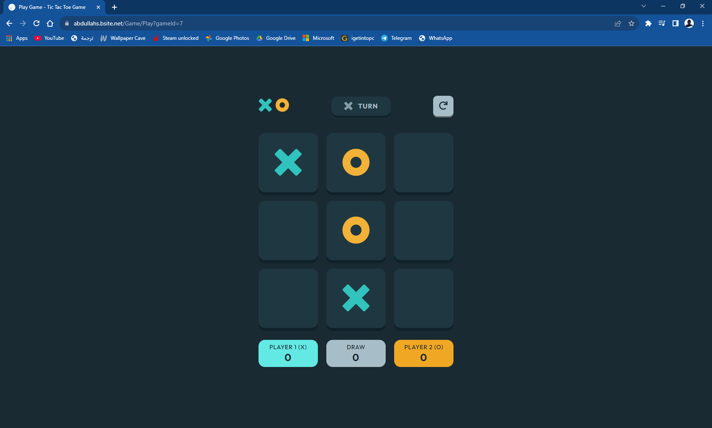
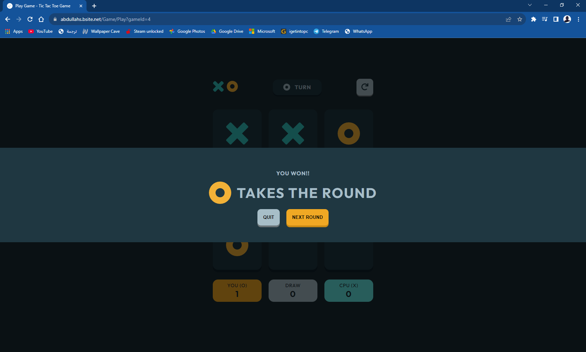
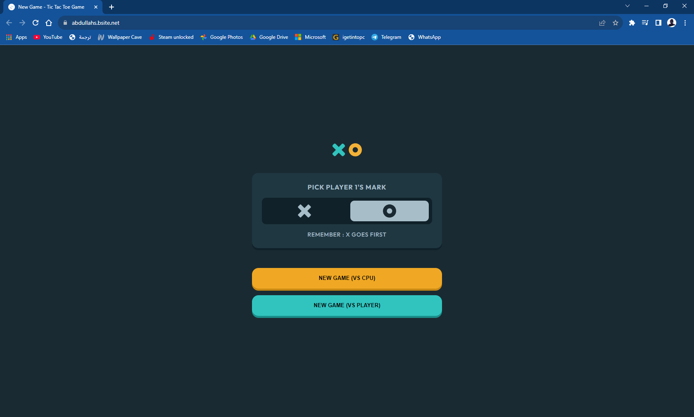

# EYouth X DEPI Tech Challenge - Tic-Tac-Toe (XO) Game

## Submitted by  
**Abdallah Salah Abdallah**  
**EYouth DEPI_AST2_SWD5_S1**  

## Challenge Overview  
This project is a **Tic-Tac-Toe (XO) Web Application** developed using **ASP.NET Core MVC**. It supports both multiplayer and AI-based single-player modes. The application includes robust game logic, user input handling, and database integration to store and track game history.

## Features  
- **Turn-Based Gameplay** – Players take turns playing 'X' and 'O'.  
- **Win Detection** – Identifies winning conditions via rows, columns, or diagonals.  
- **Draw Handling** – Detects and processes draw scenarios.  
- **Database Integration** – Stores game history using **SQL Server**.  
- **Interactive UI** – Clickable game board with real-time updates.  
- **Game Modes** – Supports both **single-player (AI)** and **multiplayer** modes.  
- **Deployment** – The game is hosted online at **[Tic-Tac-Toe Online](https://abdullahs.bsite.net/)**.  

## Screenshots  
### Game Interface  
  
### Win Detection  
  
### Database Integration  
  

## Demo Video  
Watch the gameplay and features in action:  
[](Screenshots/demo-video.mp4)  

## Implementation Steps  
1. **Setup** – Create an **ASP.NET Core Web Application** using **MVC**.  
2. **Game Logic** – Implement turn handling, win conditions, and database-driven game state management.  
3. **Frontend Development** – Design an interactive UI using **HTML, CSS, and JavaScript**.  
4. **Game Modes** – Implement both **single-player (AI)** and **multiplayer** gameplay.  
5. **Architecture** – Consider **Clean Architecture** or **Onion Architecture** for maintainability.  
6. **Testing & Deployment** – Ensure functionality and deploy the application to a hosting service.  

## Project Structure  
```
/Database
│── /Scheme            # Database schema files
│── /T-SQL             # SQL scripts for database creation
/TechChallenge         # Full-stack .NET Web Developer Tech Challenge files
/Screenshots           # Images and videos for demonstration
/TicTacToeGame
│── /Controllers       # Handles game logic and UI interactions  
│── /Models            # Defines data structures  
│── /Views             # Contains UI files (HTML)   
│── /Assets            # Images and icons
│── /Styles            # Stylesheets (CSS)
│── /Scripts           # JavaScript files
│── Web.config         # Configuration settings
```

## Setup Instructions  
### Prerequisites  
- **.NET SDK** (Version 4.8, used with MVC5)  
- **SQL Server**  
- **Visual Studio 2019 or later**  

### Installation  
1. **Clone the Repository**  
   ```bash
   git clone https://github.com/Agnefits/TicTacToeGame.git
   cd TicTacToeGame
   ```  
2. **Configure Database**  
   - Create the database and tables in SQL Server or use the online version.
   - Update `Web.config` with the correct SQL Server connection string.

3. **Run the Application**  
   - Open the project in **Visual Studio**.  
   - Build and run the application.  
   - Launch the game in a browser.  

## Live Version (Deployment)  
Test the deployed version at **[Tic-Tac-Toe Online](https://abdullahs.bsite.net/)**.  

## Support  
For issues or inquiries, create a **GitHub Issue** or contact me directly.

